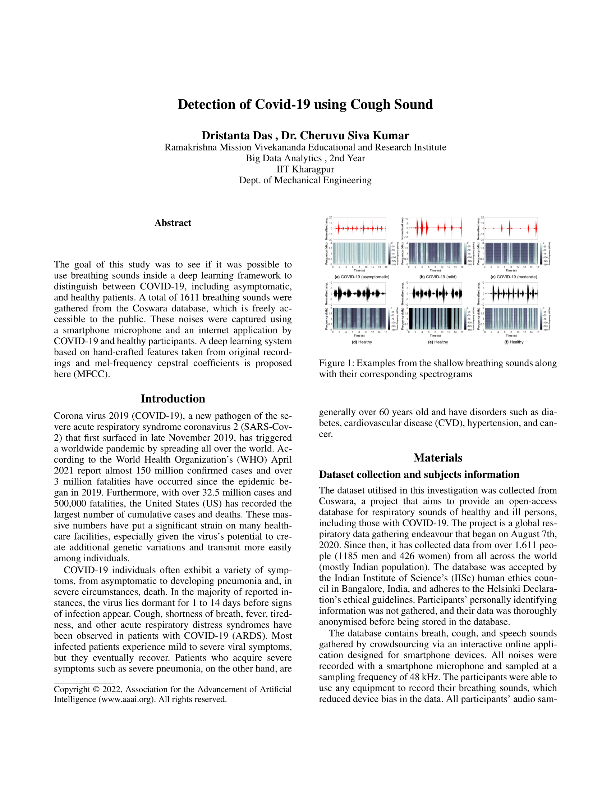
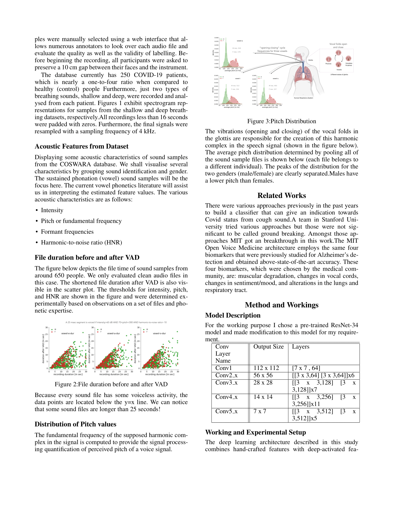
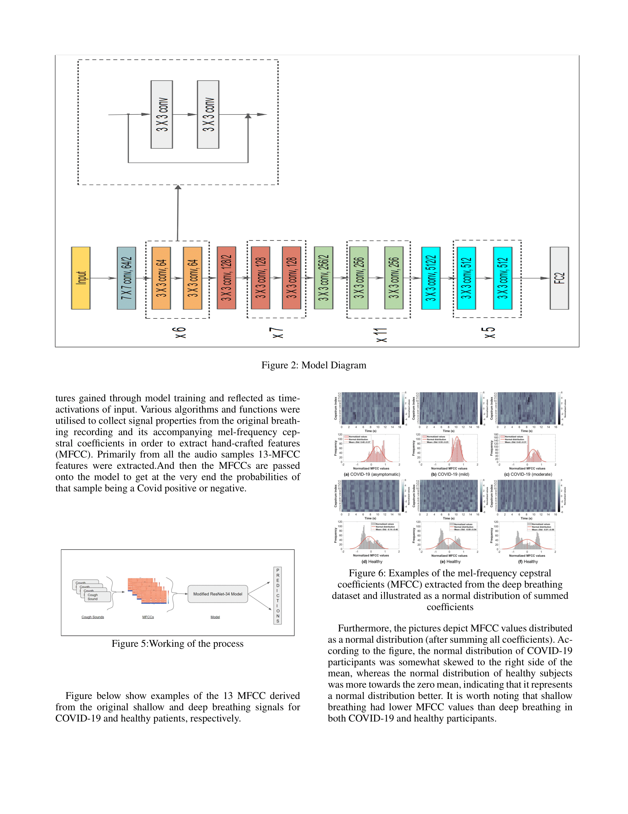
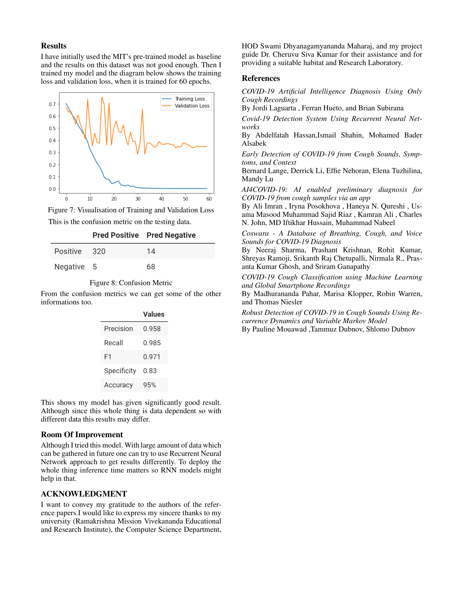

# Cough2Covid

Detecting COVID-19 from cough and breathing sounds with deep learning.

This repository contains the research notebooks and project report for a summer project
(Dristanta Das, guided by Dr. Cheruvu Siva Kumar, IIT Kharagpur). Audio recordings
from the public [Coswara](https://github.com/iiscleap/Coswara-Data) dataset are converted into
13-coefficient MFCC sequences. Several classifiers are then trained to separate COVID-19 positive
participants from healthy ones. The best model is a modified, ImageNet-pretrained **ResNet-34**.

> **Disclaimer:** this is a research/academic project and not a medical diagnostic tool.

## Repository contents

| File | Description |
|---|---|
| `Data_Prep_Diff_Ly.ipynb` | Audio preprocessing utilities: a `features` class (spectral features, ZCR, RMS power, dominant frequency, spectral flux, spectral slope/decrease, MFCC mean/std, crest factor, segment length, band PSD), `preprocess_cough` (mono conversion, normalisation, 4th-order Butterworth low-pass at 4.5 kHz, downsampling), `classify_cough` (checks whether a clip is a cough), `segment_cough` (hysteresis-based cough segmentation) and `compute_SNR`. |
| `trying_oversampling.ipynb` | Main training notebook. Loads the MFCC dataset, pads sequences, does a train/test split, oversamples the COVID-positive class, then trains (1) a stacked LSTM in Keras and (2) a modified ResNet-34 in PyTorch, with Optuna hyperparameter search. Also contains the final test evaluation. |
| `Transformer.ipynb` | Experiment with a Transformer-encoder classifier (TensorFlow/Keras) on the MFCC sequences, including positional encoding, scaled dot-product attention, a custom weighted binary cross-entropy, and a pretraining variant. |
| `Knn.ipynb` | Unsupervised baseline: K-Means clustering (`fast-pytorch-kmeans`) on flattened MFCCs (~50% accuracy), plus PCA and t-SNE visualisations of the feature space. |
| `Incorporate_meta.ipynb` | Early experiment that combines the Coswara participant metadata (`combined_data.csv`) with the audio using `fastai` + `image_tabular`. |
| `Model_Viz.ipynb` | Visualises the modified ResNet-34 (`hiddenlayer` graph, `torchsummary`) and exports it to ONNX. |
| `Model_weight/readme.md` | Link to the trained model weights on Google Drive. |
| `Dristanta_Das_Summer_Project_Report.pdf` | Full project report. PNG pages are in `Dristanta_Das_Summer_Project_Report/`. |
| `.whitesource` | WhiteSource (Mend) dependency-scanning configuration. |

## Pipeline

1. **Data:** 1,611 recordings from the Coswara database (crowdsourced smartphone recordings, sampled at 48 kHz).
   The data is imbalanced, with roughly 1 COVID-positive recording for every 4 healthy ones.
2. **Features:** 13 MFCCs per frame are extracted from each recording and stored in a JSON file
   (`mfcc_3.json`, with keys `"mfcc"` and `"labels"`, where `1` = COVID-positive). Sequences vary
   from 12 to 1,294 frames, so they are zero-padded to a fixed shape of `(1294, 13)`.
3. **Split and balance:** 75/25 train/test split (`random_state=5`, giving 1,208 / 403 samples).
   The positive class in the training set is oversampled ×5, and 20% of the result is held out for validation.
4. **Model:** ResNet-34 pretrained on ImageNet. The MFCC matrix is repeated across 3 channels.
   Changes to the network:
   - The final `fc` layer is replaced with `Dropout → Linear(512, 2)`.
   - Dropout is inserted before `bn2` in `layer1[0]`, `layer1[1]` and `layer4[2]`.
   - Training uses SGD with cross-entropy loss for 60 epochs. Dropout rates, learning rate and
     momentum were tuned with Optuna.
5. **Other approaches tried:** stacked LSTM (512-512 → dense layers), a Transformer encoder,
   K-Means clustering, and fusion with participant metadata.

## Results (ResNet-34, held-out test set of 403 samples)

These figures come from the evaluation output in `trying_oversampling.ipynb`:

| Class | Correct / Total | Per-class accuracy |
|---|---|---|
| Healthy (0) | 320 / 334 | 95.8% |
| COVID-positive (1) | 68 / 69 | 98.6% |
| **Overall** | **388 / 403** | **96.3%** |

Test loss: 0.119. The notebook's summary table also reports precision 0.958, recall 0.985 and
F1 0.971. Those numbers were calculated by hand in the notebook and treat the healthy class as
"positive", so read them with that in mind.

The training/validation loss curves and the confusion matrix are in the report.

## Getting started

The notebooks were written for **Google Colab** with a GPU. They read data from and write
checkpoints to Google Drive, using paths such as `/content/drive/MyDrive/mfcc_3.json` and
`/content/drive/MyDrive/Save_model/`. Change these paths to match your setup.

Main dependencies (Python 3.7 era):

```
numpy pandas scipy librosa scikit-learn matplotlib seaborn
torch torchvision torchmetrics torchsummary optuna
tensorflow tensorflow-addons transformer-encoder
fast-pytorch-kmeans fastai image_tabular hiddenlayer graphviz
```

To reproduce the results:

1. Download the [Coswara dataset](https://github.com/iiscleap/Coswara-Data).
2. Extract 13 MFCCs per recording and save them as `mfcc_3.json` (`{"mfcc": [...], "labels": [...]}`).
   `Data_Prep_Diff_Ly.ipynb` has helper functions for preprocessing and segmentation.
3. Run `trying_oversampling.ipynb` to train and evaluate the ResNet-34 model. Alternatively, load the
   pretrained weights from the link in [`Model_weight/readme.md`](Model_weight/readme.md) using
   `model_ft.load_state_dict(torch.load(path))`.

## Model weights

The trained weights are available [here](https://drive.google.com/drive/folders/1iT6XWv9L5kvC85VYkZ8bg0mzisPSC0bA?usp=sharing).

## Project report

The full report is in [`Dristanta_Das_Summer_Project_Report.pdf`](Dristanta_Das_Summer_Project_Report.pdf).






## References

- J. Laguarta, F. Hueto, B. Subirana: *COVID-19 Artificial Intelligence Diagnosis Using Only Cough Recordings* (MIT)
- N. Sharma et al.: *Coswara: A Database of Breathing, Cough, and Voice Sounds for COVID-19 Diagnosis*
- A. Imran et al.: *AI4COVID-19: AI Enabled Preliminary Diagnosis for COVID-19 from Cough Samples via an App*
- M. Pahar et al.: *COVID-19 Cough Classification using Machine Learning and Global Smartphone Recordings*
- A. Hassan, I. Shahin, M. B. Alsabek: *COVID-19 Detection System Using Recurrent Neural Networks*

## Acknowledgments

Thanks to Ramakrishna Mission Vivekananda Educational and Research Institute and IIT Kharagpur
(Dept. of Mechanical Engineering) for their support.
